# AndroidGroup02

## Android Application for Prediction of COVID-19

## Team Members: &nbsp; Vineetha Batchu, Sai Manideep Allu, Dhanusha Dommati

This project helps to identify the probability whether a person can get COVID or not. This project also provides a screen for calculating the Body Mass Index and a link to WHO'S diet chart will be provided, also this application predicts the vaccination date based on the vaccine and previous dose dates, gives some answers to predefines FAQ’S and a Pharmacy list screen which gives the list of pharmacies around 50 miles from Maryville and a medicine remainder for reminding the medicines.

## Activities:Main Screen consists of the following screens.
### Covid-Prediction: 
Prediction of COVID is done based on oxygen levels, symptoms like Oxygen levels, Creatinine levels, blood pressure, cough, cold, headache, sore throat, asthma, had any chronic diseases like heart diseases, cancer, HIV etc., contacted any person who has covid. 
### Vaccination: 
This activity suggests the vaccination dosage based on the person’s history whether they had first dose. If a person is vaccinated, then this app suggests after how many days that a person can get booster dose.
### BMI and Diet:
This activity calculates the BMI index for each person and suggests some healthy diet to have a better life.
### Pharmacies List: 
This activity displays the list of pharmacies around 50 miles from maryville.
### Medicine Remainder:
This screen is useful for adding remainder for medicines.
### FAQ's Screen:
This screen displays answers for a few predefined questions.

### Test Credentials:&nbsp; input for the application is as follows
### For Covid Prediction Screen:
              &nbsp;&nbsp;&nbsp;&nbsp;&nbsp;&nbsp;&nbsp; 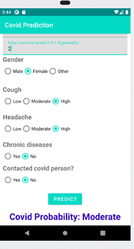 
### For Diet Chart& BMI:
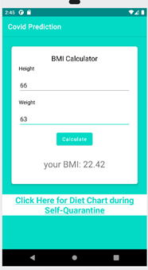
### For Vaccination Screen:
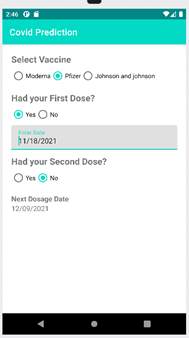
### For Medicine Remainder:
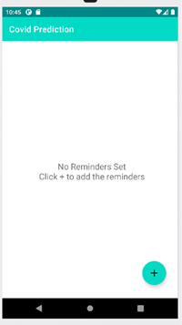     &nbsp;&nbsp;&nbsp;&nbsp;&nbsp;&nbsp;&nbsp;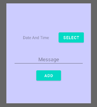 &nbsp;&nbsp;&nbsp;&nbsp;&nbsp;&nbsp;&nbsp;
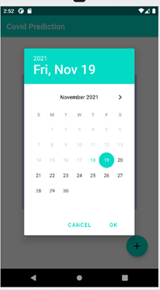   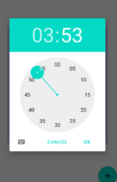 &nbsp;&nbsp;&nbsp;&nbsp;&nbsp;&nbsp;&nbsp; 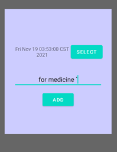
### For PharmacyList Screen:
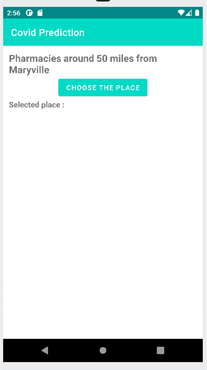 &nbsp;&nbsp;&nbsp;&nbsp;&nbsp;&nbsp;&nbsp; 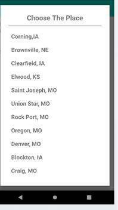 &nbsp;&nbsp;&nbsp;&nbsp;&nbsp;&nbsp;&nbsp; 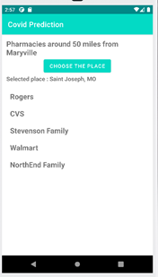
### APK:  
[Download APK](https://github.com/saimanideepallu/AndroidGroup02/blob/master/app-debug.apk)
### Supported Devices: 
Supports Android Devices having OS ranging from Android 5.0(lollipop) to Android 11.0(R)

